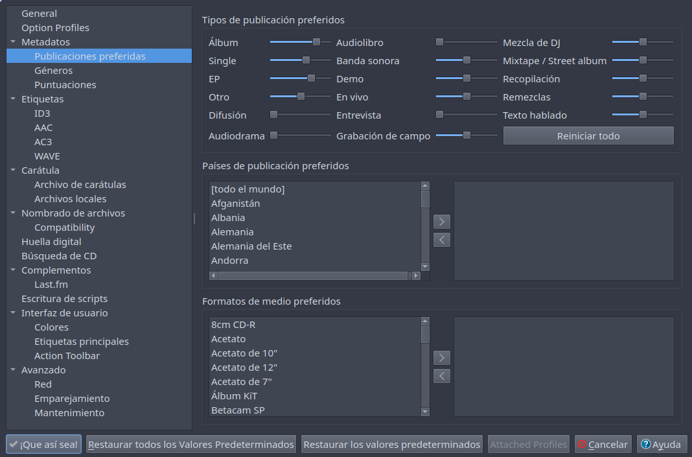
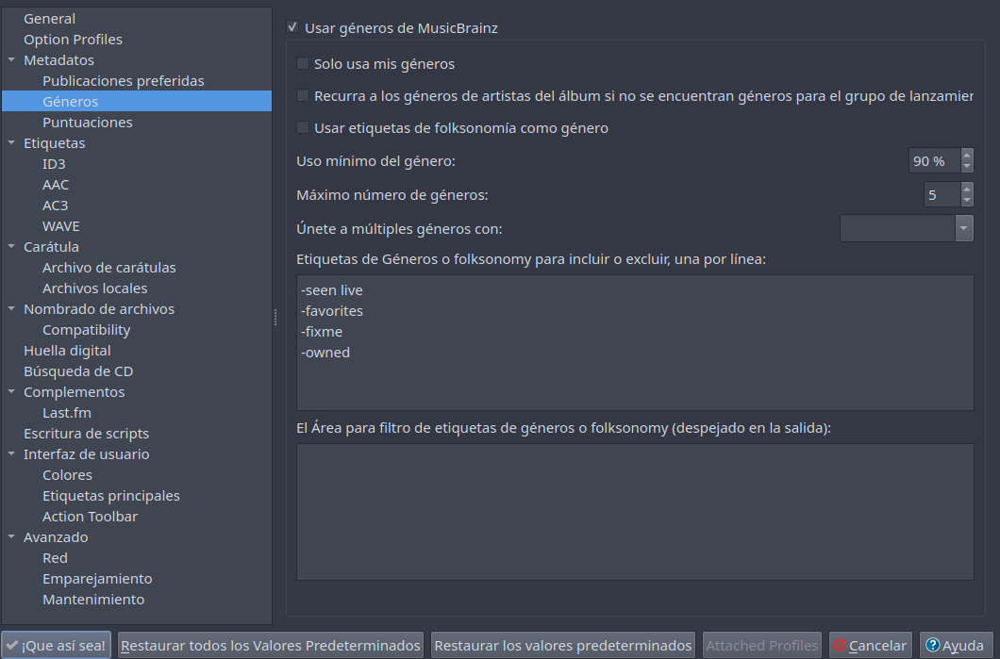
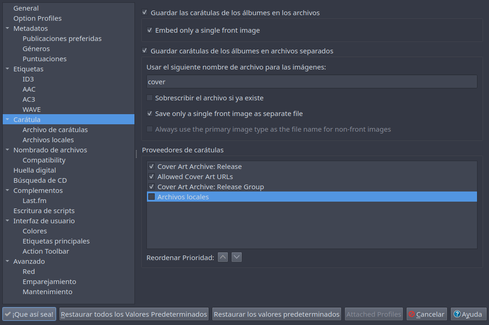
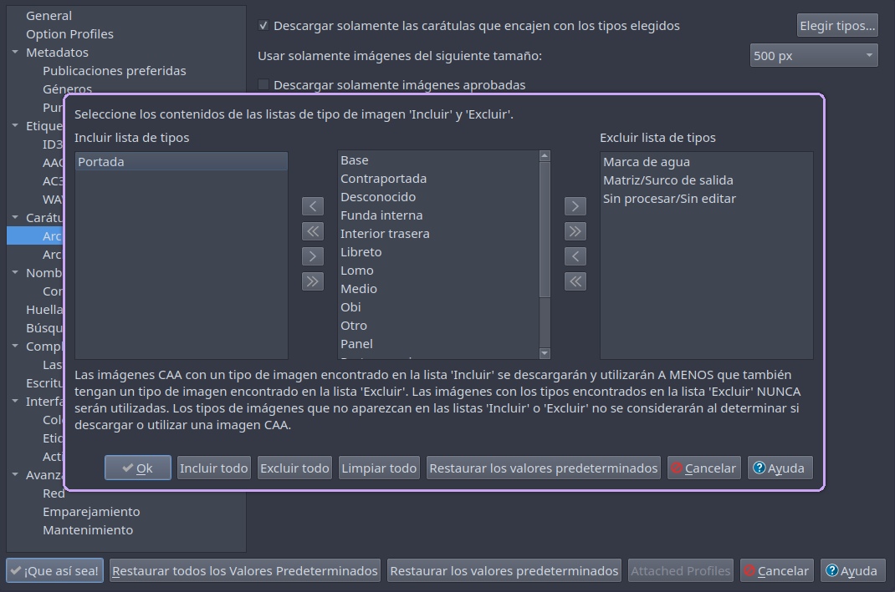
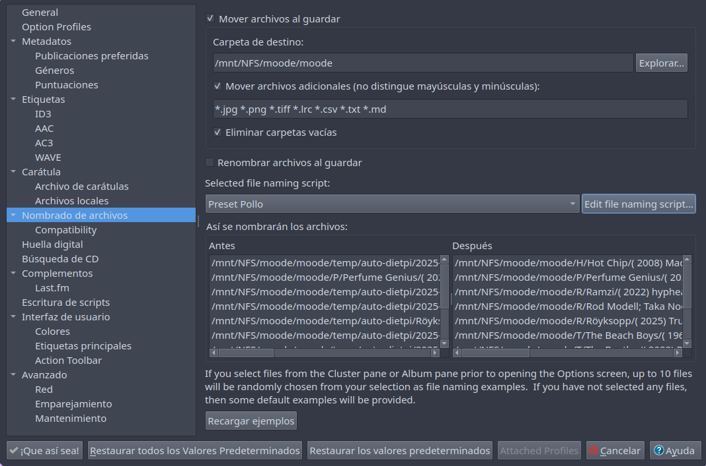
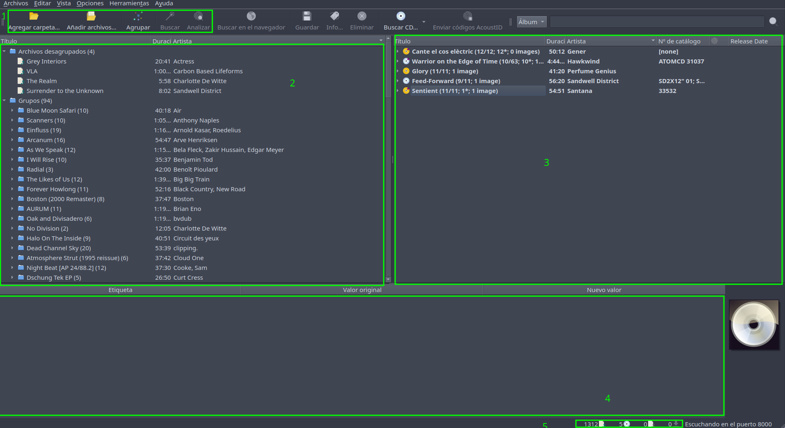
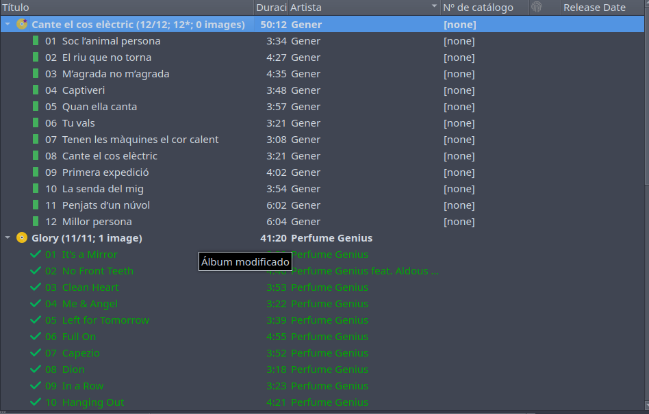
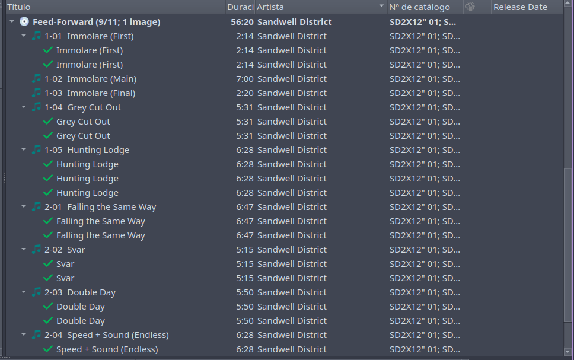

### Descripción
Esta maravilla de app te permitirá con una configuración mínima inicial, escanear tu música digital y añadir rápidamente tags a la misma sin esfuerzo.

Otras posibilidades opcionales que cubriremos en esta pequeña guía:
- Descarga de carátulas
- Renombramiento de archivos
- Restructuración de carpetas 
- Manejo de colecciones en musicbrainz 
- Añadir a musicbrainz releases que no existen en la base de datos


Primero echemos un ojo a la configuración en `Opciones > Opciones`

Es necesario acceder con nuestra cuenta de musicbrainz solo si necesitas añadir elementos a tu colección o quieres añadir elementos a su base de datos

### Idioma 
En `Metadatos` eligiremos el idioma para traducir aquellos con carácteres extraños como asiáticos, árabes... Facilita la búsqueda de los mismos 

![[Pasted image 20250602152844.png|575]]

### Publicaciones preferidas
Dependiendo del origen de su biblioteca musical es posible afinar las prioridades de búsqueda en la base  de datos.

Este es un ejemplo personal para una predominancia de albums, eps y singles de cualquier país y formato con algunas exclusiones. Recomendaría probar con el formato estándar y personalizar al gusto según la cantidad de aciertos en las búsquedas. 



### Géneros
Sin seleccionar esta opción mantendrá los géneros que contenga la metadata de los archivos, es posible eliminar ciertos géneros que no nos gusten.



### Carátulas
Aquí puedes elegir los orígenes de las posibles carátulas para tus álbumes, si prefieres guardar solo la portada, o el resto de imagenes como contraporada, fundas, ..., o si quieres adjuntarla a cada archivo






### Renombrado y restructuración

Puedes usar reglas que leeran los tags nuevos que hemos añadido a los archivos y modificar nombres de archivos o carpetas.

Este preset personalizado creará una estructura de archivos asi:

```
INICIAL / ALBUM_ARTIST / (fecha) ALBUM (sello) (nº catalogo) / DISCOS / CANCIONES

E/
 |-Enrique Morente & Lagartija Nick/
 |  |
 |  |-(1996) Omega  (El Europeo) (EEM 001)/
 |  |  |
 |  |  |-Disc 1
 |  |  |  |- cover.jpg
 |  |  |  |- 01. Omega.flac
 |  |  |  |- 02. Pequeño Vals Vienés (Take This Waltz).flac
 |  |  |  |- ...
```





Para usar este misma estructura o partir de la misma añade un preset con :

```musicbrainz
$if(%albumartist%,$left(%albumartist%,1),$left(%artist%,1))/$if2(%albumartist%,%artist%)/$if(%date%,\( $left(%date%,4)\) )%album%$if(%label%, \(%label%\))$if(%catalognumber%, \(%catalognumber%\))/$if(%discnumber%,Disc %discnumber%)/$num(%tracknumber%,2) - %title%
```


# Funcionamiento
Este es el menú principal, con unos ejemplos pendiente de ser tagueados.



1. Botones que usaremos
2. Archivos añadidos, sin escanear
3. Archivos escaneados, esperando decisiones
4. Tablas de tags antiguos VS nuevos
5. Progreso de las instrucciones dadas

> Si tienes una gran colección de música puede ser interesante ejecutar esta aplicación en un servidor que tenga acceso a tu biblioteca, para poder pausar la tarea y volver más tarde.


### 1. Agregar Carpeta
Añade tu biblioteca y espera a que se carguen todos los archivos, podrás controlar el avance en (5) 

### 2. Agrupar
Agrupará por tags y estructura de archivos los álbumes.

### 3. Buscar
Buscará las carpetas seleccionadas como álbumes, eps, singles, ... en musicbrainz.org revelando en el panel derecho (3) aquellos encontrados:

### 4. Analizar
En el caso de no encontrar las canciones con Buscar, se puede buscar a través de la huella digital de audio de cada pista

### 5. Modificaciones

En esta imagen puedes ver un álbum pendiente de tags en la parte superior, con un pequeño asterisco rojo que indica que aun no se han guardado los tags

El segundo disco aparece con ticks en las canciones, señal de que han agregado los tags


- Aquellos que aparezcan con un icono dorado indican un acierto completo
- Los iconos plateados reflejan una coincidencia parcial, es necesario revisarlos para ajustar correctamente la version de la producción seleccioanda, normalmente con un cambio de release es fácil convertirlos en dorados.

En este caso tengo el disco en dos localizaciones diferentes, seleccionando cada archivo puedes ver su ruta en el status bar (borde inferior izquierdo de la ventana) y así decidir cual quedarte.

Con el menu contextual de cualquier disco podras ver `Otras versiones` para poder elegir el release correcto con el numero de tracks adecuado a tus archivos

### 6. Guardar 
Una vez conseguido el estado dorado, y comprobados que los tags que va a introducir en tus archivos son los apropiados, puedes guardar los mismos. 

En caso de haber seleccionado "Mover Archivos" en el menú "Opciones" se moverán tras ser tagueados