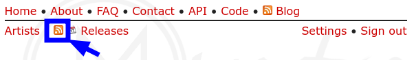

Otra maravilla del código abierto, en su página puedes agregar manualmente tus artistas favoritos para poder estar al tanto por mail o RSS de sus lanzamientos.

Puedes obtener su id tras [crear una cuenta](https://muspy.com/signup).

Para obtener el id y usarlo en esta app puedes copiar el enlace del icono RSS:



Y quedate con la última parte tras `id=`
```https
https://muspy.com/feed?id=este_será_tu_id
```