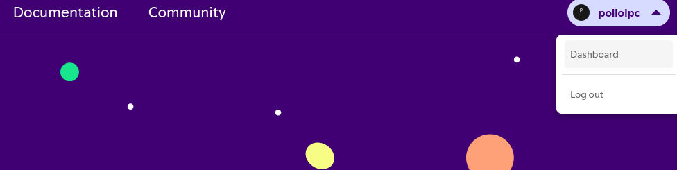
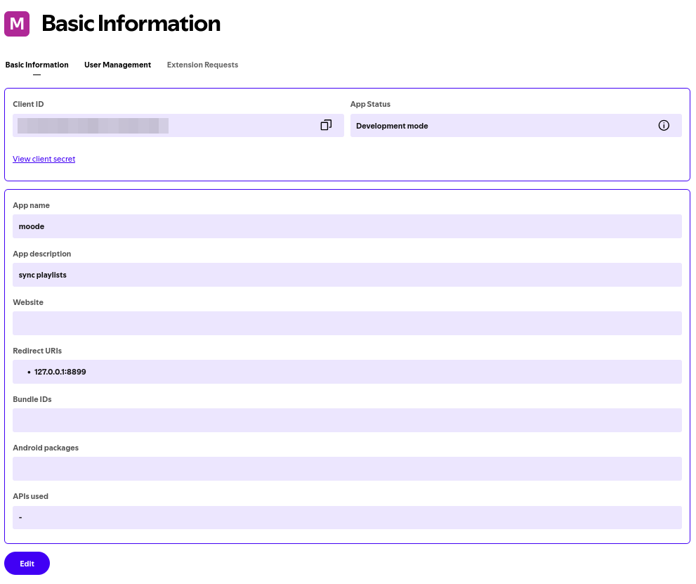

Primero accede con tu cuenta spotify [aquí](https://www.youtube.com/watch?v=oHg5SJYRHA0), que no, que era [aquí](https://developer.spotify.com/)

Luego accede a tu dashboard

Crean una app nueva especificando un `nombre` y una `redirect-uri`, copien esta última junto al client-id y client-secret

Ten en cuenta que Spotify permite un máximo de 20.000 consultas por día, tendrás que ajustar el lanzamiento del script si superas dicho número de elementos. 

Se realizará una consulta por cada artista, álbum y canción existente en la base de datos. Una vez usado el primer script [[db_musica_path.py]] puedes consultar cuantos elementos existen en tu base de datos usando [[Spaces/Scripts/menus/musica/base_datos/tools/consultar_items_db.py]]