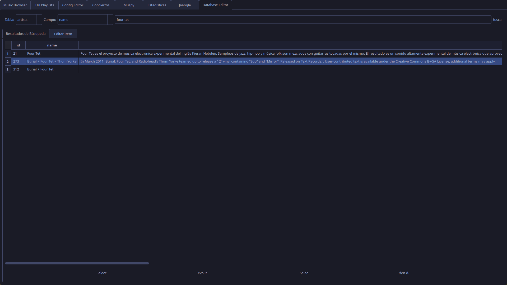

En este módulo se podrán editar campos de la base de datos, buscando primero el elemento a editar, y pulsando editar luego nos mostrará un nuevo formulario con los elementos posibles a editar.

> Mucho cuidado con editar algo que no sea una canción, enlace, o campo de texto con información, actualmente no maneja bien los encadenamientos, por lo que si editas un artista, puede que sus discos queden huérfanos.

Script:
[[editor_module.py]]

