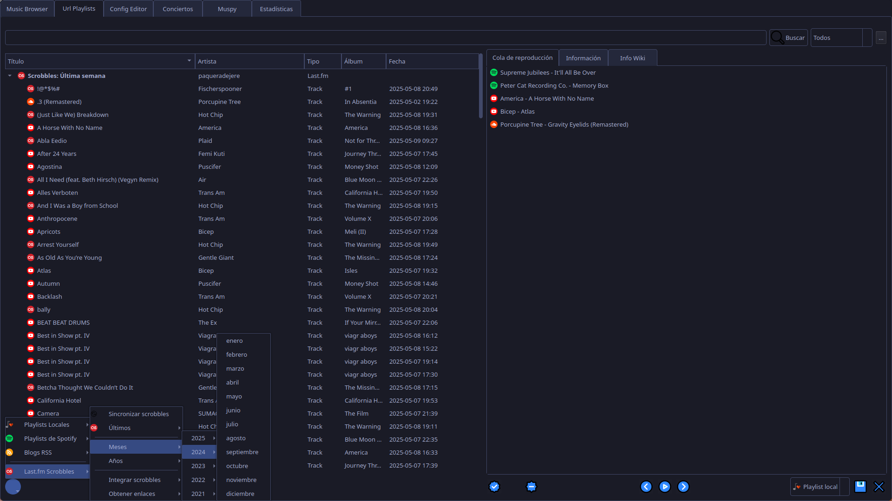

Permite buscar artistas, álbums o canciones en diversos servicios o añadir un enlace a los mismos para:
- Guardar playlists en:
	- Local
	- Rss server (actualmente FreshRss)
	- Spotify (requiere credenciales)
	- youtube??
- Reproducir en `mpv` local o enlaces
	  
Los servicios admitidos son:
- Base de datos local
- Bandcamp
- Soundcloud
- Spotify (requiere credenciales)
- Youtube 


Muestra información del artista o álbum buscado de la base de datos

Pensado para crear una playlist mensual de cada blog musical que sigo en FreshRss:

1. Obtiene las urls a los posts no leídos de mi servidor freshrss y las separa por meses de publicación
2. Busca en cada post, enlaces a youtube, bandcamp y soundcloud y los añade a la playlist
3. Busca con yt-dl el nombre de cada enlace y crea un archivo .txt llamado igual que la playlist para poder mostrar el nombre cuando se pueda.

Se pueden añadir urls a post singulares para crear una playlist del mismo extrayendo los enlaces a los servicios admitidos y guardarla en playlist locales.

Actualmente reproduce las canciones en mpv.


```tasks
not done
tags include #m_fuzzy
tags include #url 
hide tags
sort by due
sort by priority
sort by scheduled
```