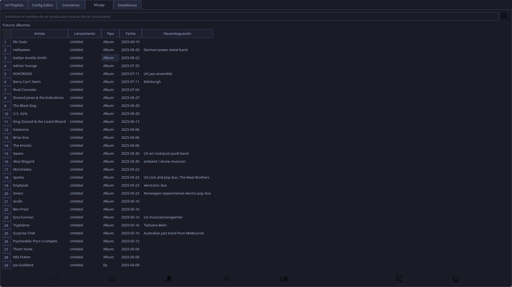

Este modulo en combinación con la api de [Muspy](https://muspy.com/) permite consultar que artistas van a sacar una nueva producción próximamente.

Puede leer la base de datos o realizar búsquedas individuales de los mismos en muspy  y lo muestra en un listado.

#### Menús:

- `Cargar desde db` Permitirá buscar artistas y álbumes que seleccionar, para seguir a todos los artistas en muspy
- `Sincronizar base de datos con...` Seguirá todos los artistas seleccionados previamente en muspy o spotify. También permite seguir en muspy a tus X artistas más escuchados en lastfm.
- `Mis próximos discos` Mostrará un listado de los próximos discos anunciados para los artistas que sigues en muspy.
- `Spotify` Ofrece diversos submenús:
	- `Mostrar artistas seguidos`
	- `Nuevos álbumes de artistas seguidos`
	- `Canciones guardadas`
	- `Top items`
	- `Limpiar caché`
- `Lastfm` Dará acceso a los artistas más escuchados y las canciones favoritas
- `musicbrainz` Te permitirá consultar las colecciones de tu usuario, agregar alguna y añadir elementos a las mismas.
- `Networks` Usará la api de bluesky para buscar tus artistas, y seguir aquellos que te parezcan reales pudiendo ver su profile, foto y los últimos mensajes.

