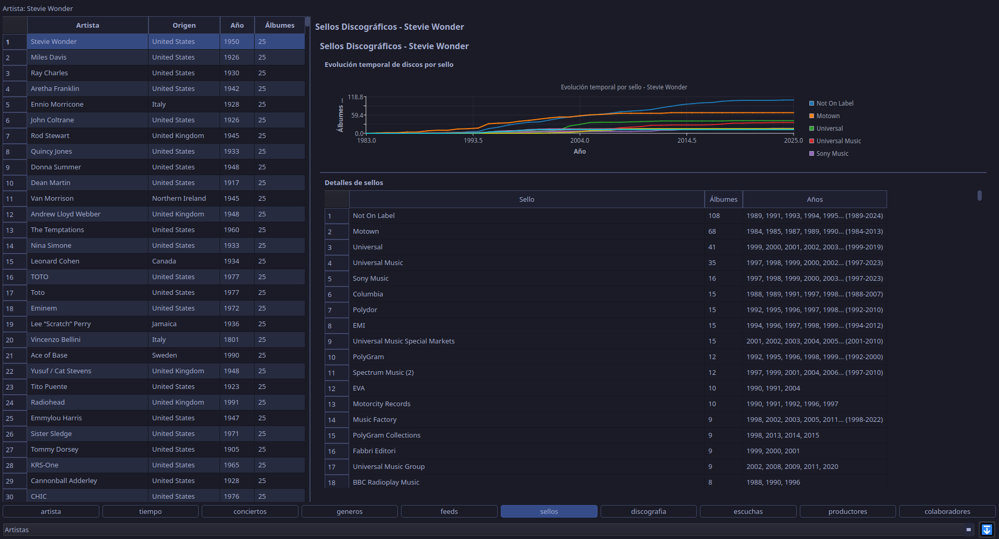
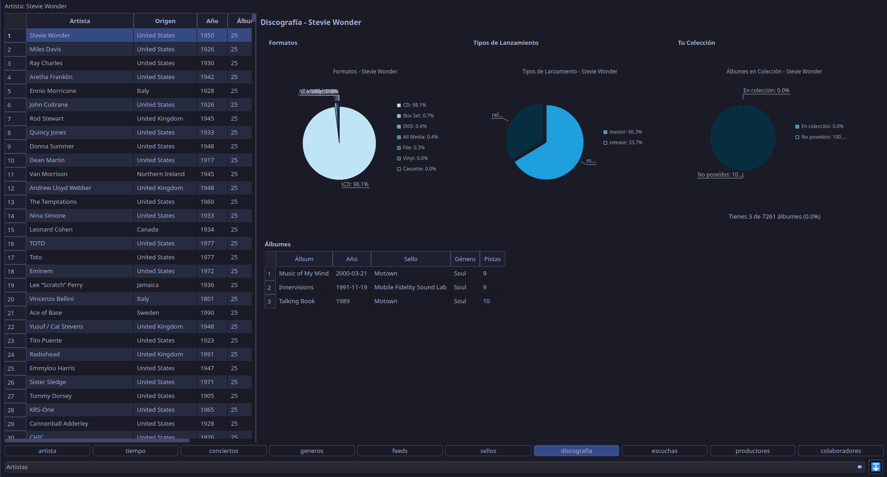
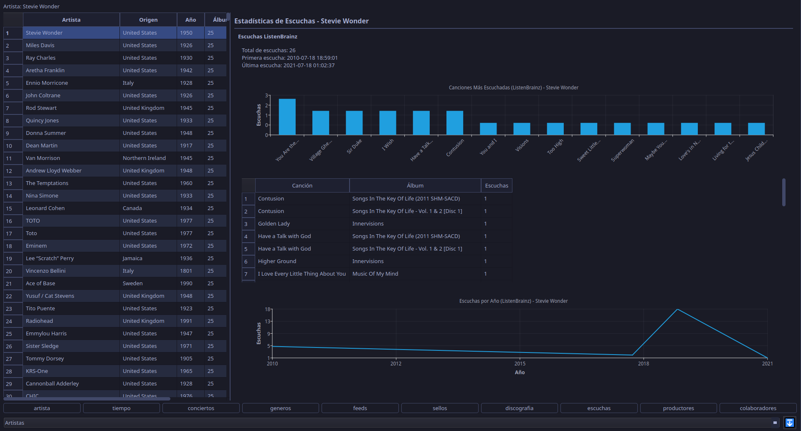
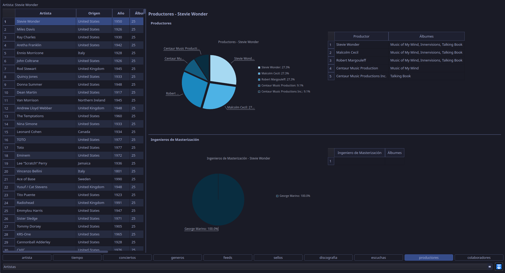
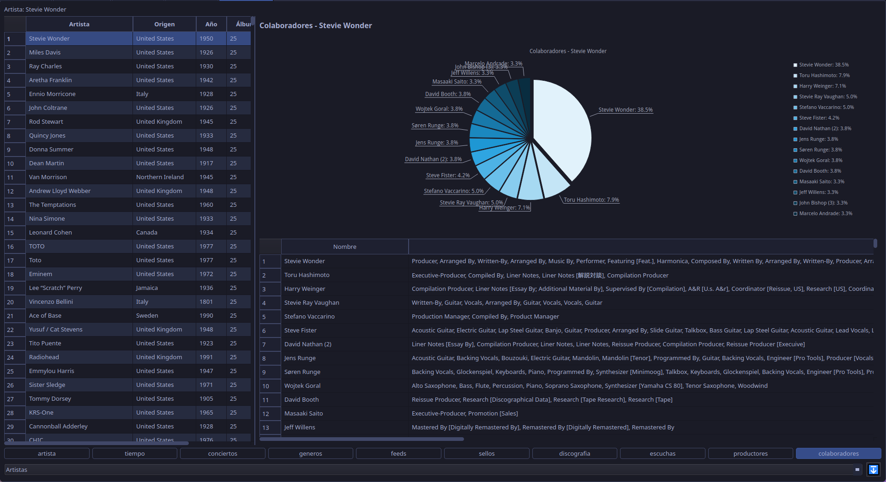
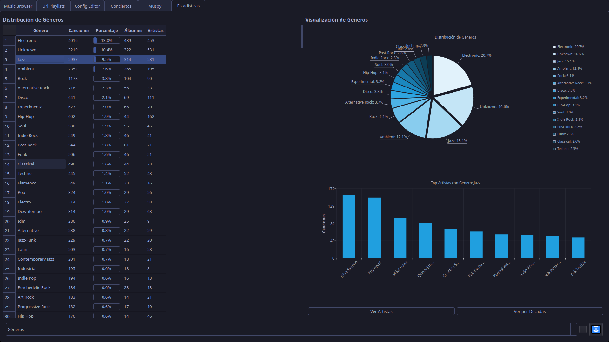
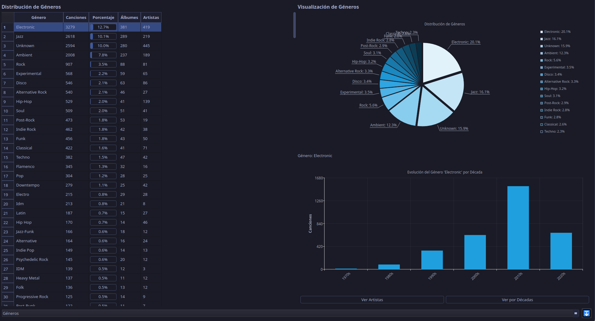
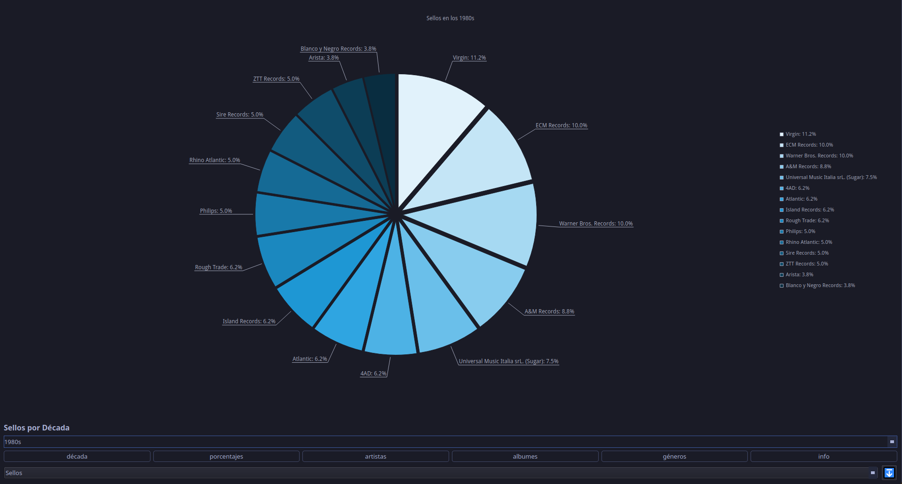
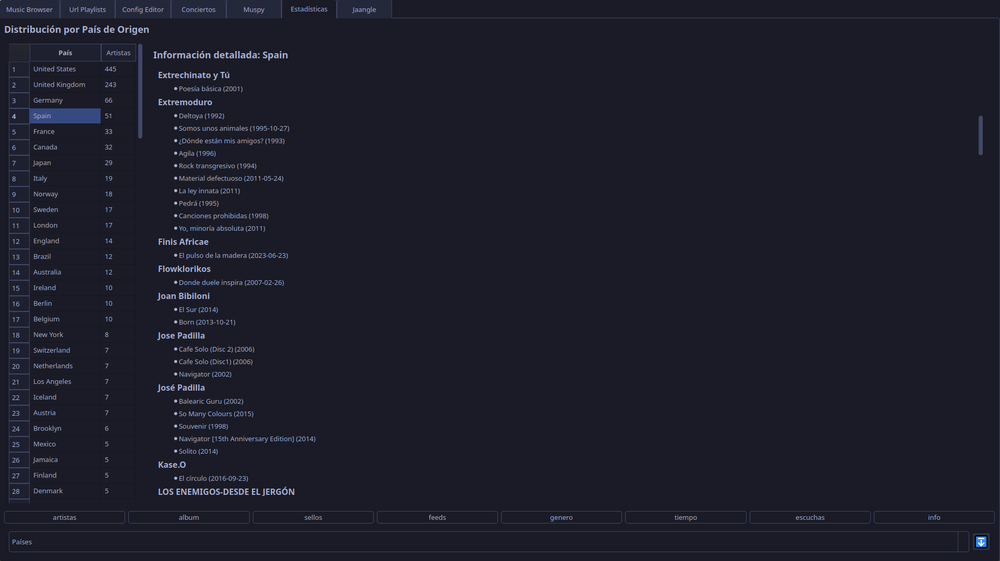
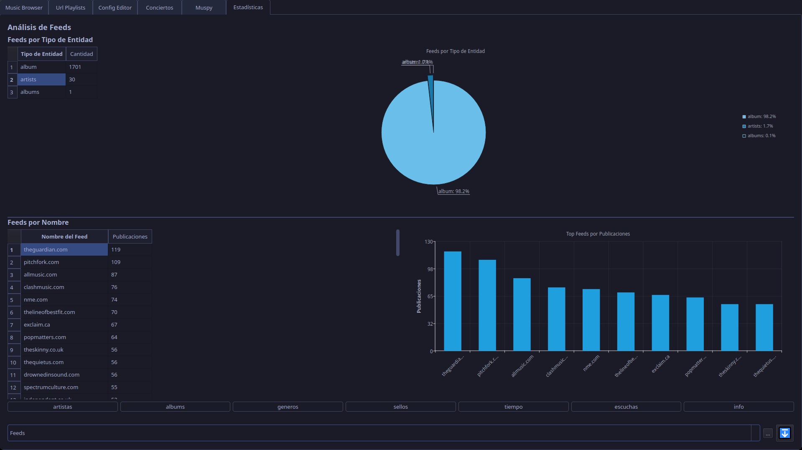

Con este módulo podras obtener estadísticas sobre todos los datos recopilados desde diferentes perspectivas:

- ##### Artistas

	- **Tiempo**
	
	- **Géneros**
	
	- **Sellos**
	
	- **Discografía**
	
	- **Escuchas**
	
	- **Productores**
	
	- **Colaboradores**
	

- ##### Álbums
TODO
- ##### Canciones
TODO
- ##### Fecha
TODO
- ##### Géneros
	- **Artistas**
	  
	- **Décadas**
	  

- ##### Sellos
	- **Distribución de álbumes**
	
	- **Década**
	
	- **Sellos**
	
	- **Álbumes de un sello**
	
	- **Información en texto**
	

- ##### Productores
TODO
- ##### Paises

- ##### Colaboradores
TODO
- ##### Feeds

- ##### Escuchas
