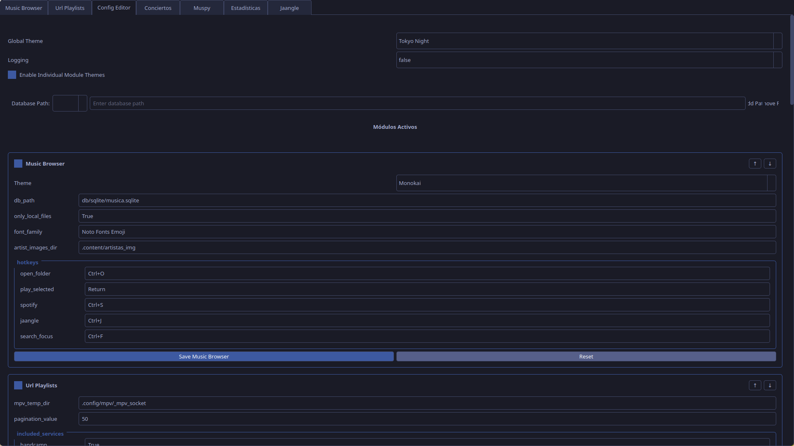

Este es el módulo encargado de crear una UI para la configuración y permite modificar cualquier argumento recibido por el resto de módulos.

Las claves del json [[Spaces/Scripts/menus/musica/config.json|config.json]] con múltiples opciones se mostrarán como un menú desplegable.

Script:
[[config_editor_module.py]]