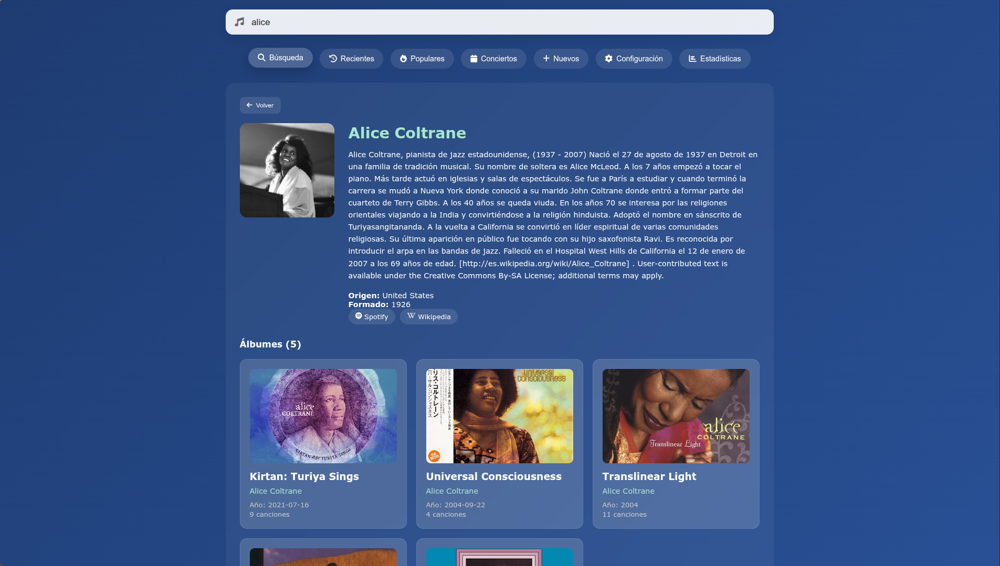
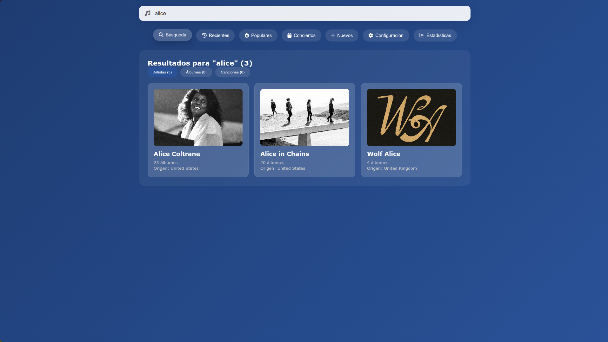
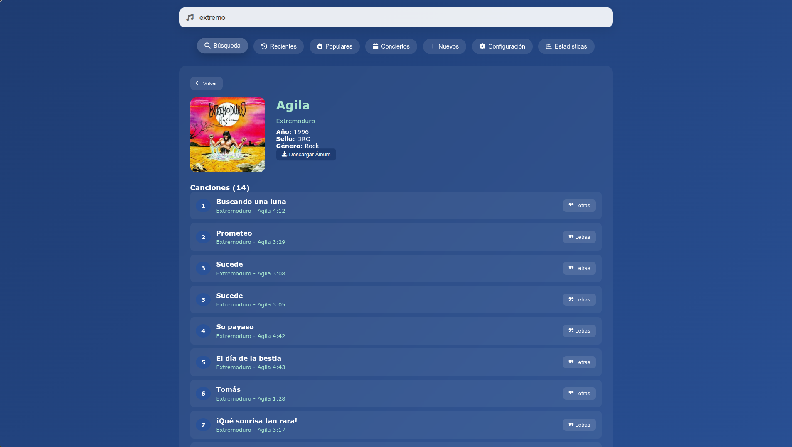

Este contenedor junto a la base de datos creada permitirá acceder a una version web de la app remotamente.

Gracias a ella podremos:
- Ver información de wikipedia y lastfm de los artistas
- Consultar los enlaces de las canciones, álbumes o artistas
- Descargar al dispositivo conectado, o realizar una copia a otra carpeta especificada en el docker-compose.yml 

**Busqueda instántanea**

**Descargar o copiar a servidor**

**Letras**

**Estadísticas artistas**

**Estadísticas álbumes**

**Estadísticas Escuchas**

